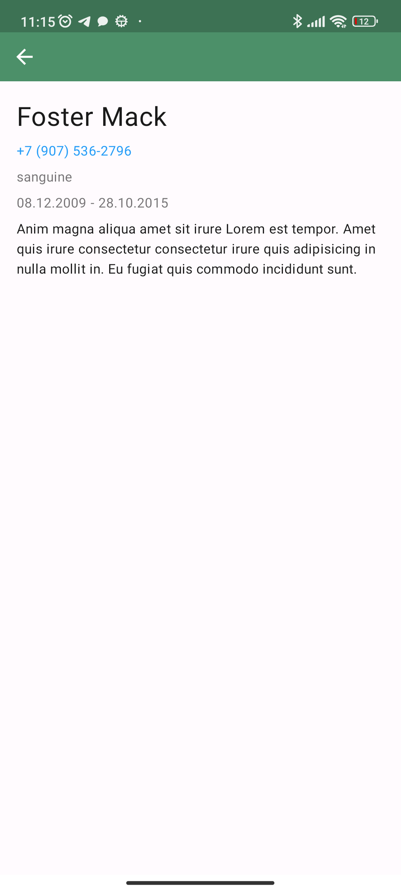

# Тестовое задание для Контур

## Испоьзованные технологии

- Jetpack compose
- Dagger Hilt (KSP)
- Jetpack navigation
- Paging 3
- Retrofit 2
- Gson
- Kotlin flow
- Kotlin coroutines
- Room (KSP)

## Скриншоты

